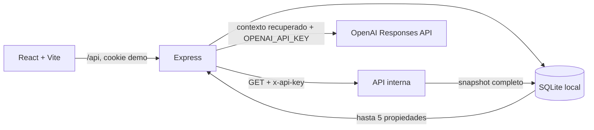

# Inmuebles el Éxito


**Catálogo inmobiliario local con asistente conversacional fundamentado.** Consulta propiedades sincronizadas desde una API interna, conserva historiales separados por perfil demo y responde únicamente con información recuperada del catálogo.


## Contenido

- [Características](#características)
- [Arquitectura](#arquitectura)
- [Inicio local](#inicio-local)
- [Variables de entorno](#variables-de-entorno)
- [Pruebas](#pruebas)
- [Grounding y seguridad](#grounding-y-seguridad)
- [Limitaciones conocidas](#limitaciones-conocidas)

## Características

- Catálogo sincronizado desde una API interna protegida con `x-api-key`.
- Filtros por tipo, ubicación, texto y rango de precio en GTQ.
- Detalle de propiedad con imágenes disponibles, especificaciones y alertas de calidad de origen.
- Tres perfiles demo con historial aislado mediante cookies de sesión opacas.
- Asistente RAG que recupera hasta cinco propiedades locales antes de consultar OpenAI.
- Fuentes visibles en cada respuesta y respuesta determinista cuando faltan datos.
- Estados persistentes `pendiente`, `respondida`, `error` y `cancelada`.
- Panel administrativo con conversaciones, distribución por estado y propiedad más consultada.
- Dictado opcional con Web Speech API; escribir siempre permanece disponible.
- Branding original de Inmuebles el Éxito y experiencia adaptada a móvil y escritorio.

## Arquitectura



El backend usa el módulo nativo `node:sqlite` de Node.js 22.12+ para evitar dependencias binarias y persistir el catálogo localmente.

## Inicio local

### 1. Requisitos

- Node.js 22.12 o superior.
- npm.
- Una URL y clave válidas de la API de catálogo.
- Una API key de OpenAI con facturación habilitada.

### 2. Backend

```bash
cd backend
cp .env.example .env
npm install
npm run dev
```

Edita `backend/.env` con valores reales. El backend quedará disponible en `http://localhost:4000`.

### 3. Frontend

En otra terminal:

```bash
cd frontend
npm install
npm run dev
```

Abre `http://localhost:5173`. Selecciona un perfil demo y usa el catálogo. El perfil administrativo puede sincronizar el catálogo y abrir Métricas.

## Variables de entorno

| Variable | Obligatoria | Uso |
| --- | --- | --- |
| `CATALOG_API_URL` | Sí | Endpoint `GET` del snapshot completo de propiedades. |
| `CATALOG_API_KEY` | Sí | Se envía exclusivamente en `x-api-key` desde Express. |
| `OPENAI_API_KEY` | Sí | Se usa únicamente en Express al solicitar una respuesta al modelo. |
| `PORT` | No | Puerto del backend; por defecto `4000`. |
| `DATABASE_PATH` | No | Ruta de la base SQLite local. |
| `OPENAI_MODEL` | No | Modelo; por defecto `gpt-4o-mini`. |

No uses prefijos `VITE_` para secretos. Todo prefijo `VITE_` puede terminar expuesto al navegador.

## Contrato del catálogo

El backend solicita `CATALOG_API_URL` con el encabezado:

```http
x-api-key: <CATALOG_API_KEY>
```

Se espera el siguiente contrato:

```json
{
  "success": true,
  "data": [{ "id": 1001, "propiedad": "A-1" }]
}
```

Una respuesta válida completa hace upsert de las propiedades recibidas y marca inactivas las ausentes. Las propiedades inactivas no aparecen en el catálogo, pero se conservan para no romper referencias históricas.

## Pruebas

Backend:

```bash
cd backend
npm test
```

Frontend:

```bash
cd frontend
npm test
npm run build
```

Comprobación manual de secretos antes de publicar:

```bash
node scripts/check-secrets.js
```

Las pruebas incluyen sincronización, snapshot completo, aislamiento de historial, grounding, fuentes, prompt injection, PII, errores del proveedor, cancelación, filtros, estados vacíos, errores recuperables y compatibilidad de voz simulada.

## Grounding y seguridad

1. El navegador envía texto a `/api/chat`; nunca envía claves a OpenAI.
2. Express elimina teléfonos, correos e identificadores evidentes antes de persistir o consultar el LLM.
3. SQLite recupera propiedades relevantes mediante código, tipo, proyecto, ubicación, precio y texto.
4. Si no hay resultados, el backend responde sin invocar OpenAI.
5. OpenAI recibe instrucciones, datos de catálogo y pregunta en bloques separados.
6. La salida requiere JSON estructurado con `answer` y `sourceIds`.
7. El backend rechaza fuentes que no pertenezcan al conjunto recuperado.
8. Cada respuesta guarda sus propiedades fuente en `message_property_sources`.

Los límites iniciales son 10 consultas por minuto y sesión, hasta 5 propiedades por contexto, 600 tokens de salida y 15 segundos de timeout.

La voz usa `SpeechRecognition` si el navegador la expone. El audio no llega al backend ni a OpenAI, pero la transcripción puede depender del proveedor del navegador. El usuario ve y puede editar la transcripción antes de enviarla.

## Limitaciones conocidas

- Los perfiles demo aíslan sesiones, pero no sustituyen una autenticación real: una persona puede elegir voluntariamente otro perfil demo.
- La calidad de las respuestas depende de que el catálogo esté sincronizado y sea correcto.
- Los registros con campos contradictorios se marcan para revisión; el asistente debe declararlos, no resolverlos por su cuenta.
- El grounding reduce alucinaciones, pero una recuperación incompleta o una respuesta incorrecta del modelo siguen siendo riesgos residuales.
- Web Speech API no tiene soporte uniforme entre navegadores; la entrada de texto es el fallback permanente.
- No hay CI ni despliegue público en esta primera versión. Las pruebas se ejecutan localmente siguiendo los comandos anteriores.

## Higiene del repositorio

`.gitignore` excluye secretos, bases SQLite, logs, cobertura, builds, cachés y `example.txt`. Los lockfiles se versionan para instalaciones reproducibles. El fixture publicado en `backend/test/fixtures/catalog-response.json` es completamente anonimizado.

## Licencia

Este proyecto está disponible bajo la [licencia MIT](LICENSE).
